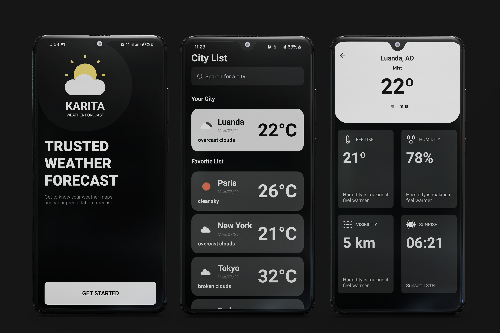

https://dribbble.com/shots/20137088-Weather-App

### Weather Forecast App
A Weather app Android development with Jetpack Compose.
Learn about Dependence Injection with Hilt and some concepts : leverage Hilt and Dagger and add Dependency Injection into a Jetpack Compose Android App and work with API.
Use of Retroift to parse data, Coroutines and get remote data from api.
Work with permission and geo location to get current user location city

## Video demo

    

## Screenshots

    

